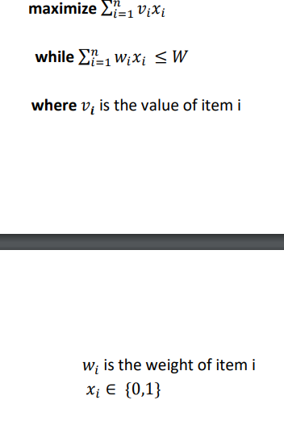

# Knapsack Problem Solver using Gravitational Search Algorithm

## A- WHAT IS KNAPSACK PROBLEM?
The Knapsack Problem is a classic optimization problem in computer science and combinatorial optimization. Given a set of items, each with a weight and a value, determine the number of each item to include in a collection so that the total weight is less than or equal to a given limit and the total value is maximized.
The knapsack problem can be modeled as the following where:

## B- WHAT IS GRAVITATIONAL SEARCH ALGORITHM?
The Gravitational Search Algorithm (GSA) is a nature-inspired metaheuristic optimization algorithm based on the law of gravity and the motion of celestial bodies. It simulates the gravitational forces between masses to search for the optimal solution in a problem space.

## C- METHODOLOGY
The methodology for solving the Knapsack Problem using the Gravitational Search Algorithm involves the following steps:

### STEP 1: INITIALIZATION
Initialize the population of solutions randomly within the search space.

### STEP 2: CALCULATION OF FITNESS VALUE AND MASS OF THE SOLUTIONS
Evaluate the fitness value of each solution based on its feasibility and objective function value. Calculate the mass of each solution.

### STEP 3: CALCULATION OF FORCE ON THE MASSES
Calculate the gravitational force acting on each solution based on its mass and the distance between solutions.

### STEP 4: CALCULATION OF ACCELERATION
Calculate the acceleration of each solution based on the gravitational force acting on it.

### STEP 5: UPDATING VELOCITY
Update the velocity of each solution based on its current velocity and acceleration.

### STEP 6: UPDATING POSITION
Update the position of each solution based on its current position and velocity.

## D- EVALUATION
In the evaluation section, we present the results of applying the Gravitational Search Algorithm to solve the Knapsack Problem. We provide the outcomes of two trial runs:

### Trial 1
Describe the setup and results of the first trial.

### Trial 2
Describe the setup and results of the second trial.

## E- CONCLUSION
In conclusion, the Gravitational Search Algorithm shows promise in solving the Knapsack Problem efficiently by leveraging the principles of gravity and motion. Further experimentation and optimization can potentially improve its performance and applicability in various real-world scenarios.

