# Knapsack Problem Solver using Gravitational Search Algorithm

## A- WHAT IS KNAPSACK PROBLEM?
The Knapsack Problem is a classic optimization problem in computer science and combinatorial optimization. Given a set of items, each with a weight and a value, determine the number of each item to include in a collection so that the total weight is less than or equal to a given limit and the total value is maximized.
The knapsack problem can be modeled as the following where:

## B- WHAT IS GRAVITATIONAL SEARCH ALGORITHM?
Gravitational Search Algorithm is one of the various heuristic optimization methods that have
been developed recently. Unlike the others that are inspired by swarm behavior, the GSA is
based on the law of gravity and mass interactions. Basically, the agents are a collection of
masses that interact with each other based on the Newtonian gravity and laws of motion. In
the process these steps are required: initialization, calculate the gravitational forces,
calculate the acceleration and velocity, update the position of the solution.

## C- METHODOLOGY
Searching for research papers on application of GSA in solving the knapsack problem, we
found a few that were not very detailed in terms of the algorithm. So, we decided to use the
general algorithm for the GSA and try and adapt it to the knapsack problem ourselves. We
referred to Wei Lei’s algorithm structure as the basis for developing our algorithm. Since the
problem was of combinatorial optimization, we encoded the problem in binary. This meant
we needed to use a version of GSA that could work on binary encoded solution space. We
found Rashedi et al.’s paper on binary gravitational search algorithm that presented the
necessary changes required in GSA to make it work with binary encoded solution space. Only
the position function of GSA was modified to a probability based function that changed the
position bits to 0 or 1 based on the velocity of the agent. We modified our base to incorporate
this change and also used a hamiltonian distance in calculating the R in the force function
instead of the euclidean distance as in the traditional GSA. We also referred to Gupta’s work
on a hybrid GA-GSA algorithm to get a better understanding of the steps required in applying
GSA to the knapsack problem. The GSA algorithm consists of the following steps: initialization,
fitness value calculation, calculation of force, calculation of acceleration, velocity update and
position update.

### STEP 1: INITIALIZATION
To initialize the algorithm, a random population of solutions is created. The number of
solution N in a population is one of the parameters that can be modified in the algorithm to
yield different test results. The population in our employed algorithm is generated using a
5
loop with the given weight constraint of 65 that selects a random mutant every loop and adds
it to a list representing a solution. Along with the solution, a bitmap of the mutant list is also
updated and maintained. The bitmap has 0s and 1s in the form of a list, each corresponding
to a mutant. Whenever a mutant is selected, the corresponding bit for the mutant is updated
to 1 to denote that the mutant has been selected. The solution formed after the completion
of the loop is checked again to see if the last addition of mutant caused the total weight of
the solution to exceed the weight constraint. If it did, it is dropped from the list and the bitmap
for the corresponding mutant is also changed to 0. Finally, the solution is added to the list of
solutions, i.e., population and the bitmap to the list of bits. The whole process reiterates for
N times so that the population has N solutions after the end of the initialization step. Besides
this, the initialization step also includes the initialization of the velocity of each of the
solutions to 0. The initialization occurs only once per run.

### STEP 2: CALCULATION OF FITNESS VALUE AND MASS OF THE SOLUTIONS
After the initialization step, the program calculates the fitness value for each of the solutions
in the population. The fitness function used calculates the total value of the mutants in a
solution. The higher the value, the fitter the solution. After the calculation of the fitness
function of each solution, the best and worst solutions are each stored in a variable. This is
then used to calculate the mass of each of the solutions. The mass is calculated by the
formula:

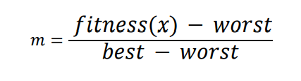

The above equation gives the mass of each individual solution. After calculating the mass for
every solution, the inertial mass of each solution is found using the formula:

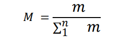

The program stores the inertial masses in a list with indices of the masses matching that of
the corresponding solution in the population list.

### STEP 3: CALCULATION OF FORCE ON THE MASSES
The force acting on the masses is the driving mechanism of GSA. The gravitational force acting
between two masses i and j is given by:

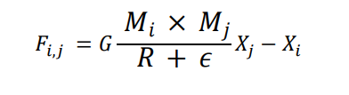

In the above equation, 𝑀𝑖and 𝑀𝑗
represent the inertial masses of agents i and j and 𝑅
represents the hamiltonian distance between i and j, whereas 𝜖 is a small constant added to
prevent division by zero. 𝑋𝑖 and 𝑋𝑗
represent the position of the agents i and j respectively.
To calculate the gravitational constant 𝐺, the following formula is used:

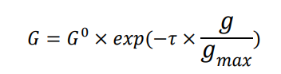

Here, 𝜏 represents a constant that is reduced every generation to improve the search
accuracy and 𝑔represents the current generation number. 𝑔𝑚𝑎𝑥is the maximum number of
generation or iteration that the algorithm will be running for. 𝐺
0
is a constant set to 1.
After the forces on each solution by the other solutions in the population are calculated the
total force on a solution is found by the formula:

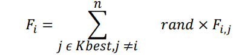

Kbest is a list that contains the best solution in the generations and it’s size decreases linearly
every generation. rand is a random floating point number between 0 and 1 added in the
equation to give the algorithm a stochastic behaviour.
The program stores the calculated force in a list, just like masses previously.

### STEP 4: CALCULATION OF ACCELERATION
The acceleration of an agent i is calculated by the equation:

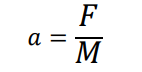

This value is calculated for every solution in the list and stored in a list

### STEP 5: UPDATING VELOCITY
The velocity of the solutions are updated with a newer velocity that is found using the
formula:

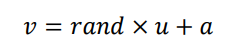

Here, u stands for initial velocity, i.e. the velocity before the update and rand is a random float
value between 0 and 1. 𝑎 is the acceleration of the corresponding solution.

### STEP 6: UPDATING POSITION
The position is updated in binary gravitational search using a probability function that
depends on the velocity of the solution. Updating position here means updating the bitmap
of a solution. The bits are complemented depending upon the probability function:

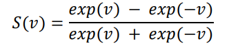

The position update function can be represented as:

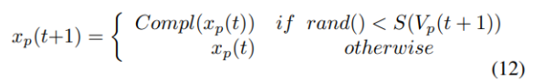

This means that the position is updated only if the random value generated is less than the
probability function calculated for the solution.
The updated position creates a new bitmap and is used to create a new population. Steps 2-
6 are repeated for the number of iterations defined in the program. After the iterations are
done, the program shows the highest value solution that was obtained during the run.

## D- EVALUATION
In the evaluation section, we present the results of applying the Gravitational Search Algorithm to solve the Knapsack Problem. We provide the outcomes of two trial runs:

### Trial 1
population_size (N) = 100, 
max_iter = 200

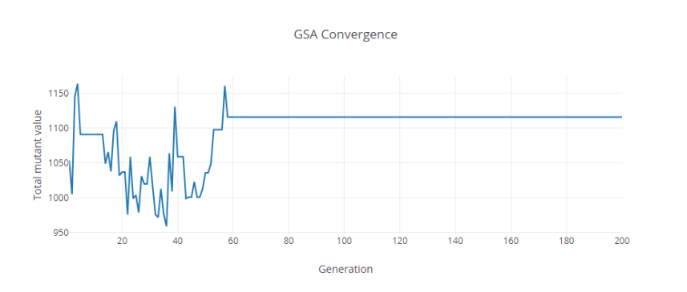

The above graph shows the convergence plot for the run with the above parameter. The graph
converges at a solution with a total mutant value of 1116 in the 58th generation. This was the
combination that was outputted by the program:
8
[[45.0, 2.0], [92.0, 8.0], [44.0, 4.0], [65.0, 8.0], [77.0, 1.0], [66.0, 2.0], [56.0, 0.0], [99.0, 5.0],
[72.0, 5.0], [89.0, 0.0], [60.0, 2.0], [51.0, 1.0], [87.0, 5.0], [63.0, 6.0], [88.0, 6.0], [62.0, 2.0]]

### Trial 2
population_size (N) = 200, 
max_iter = 50

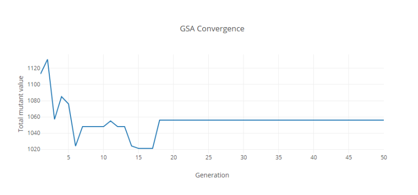

Running the program with the above parameters results in the GSA algorithm converging at
1056. The convergence takes place in the 18th generation. The combination associated with
the value is:
[[92.0, 8.0], [44.0, 4.0], [85.0, 9.0], [77.0, 1.0], [66.0, 2.0], [45.0, 8.0], [99.0, 5.0], [72.0, 5.0],
[89.0, 0.0], [91.0, 3.0], [45.0, 1.0], [51.0, 1.0], [0.0, 2.0], [87.0, 5.0], [62.0, 2.0], [51.0, 9.0]]

## E- CONCLUSION
In summary, we acknowledge that our modified Gravitational Search Algorithm does not
provide the optimal solution given by this assignment, but it is near enough. This is a proof
of how far our understanding of this gravity inspired method goes. However, the goal of
most optimization algorithms is to compare a multitude of solutions until a satisfactory
solution is found after a certain number of iterations. From the diagrams above, the more
the number of iterations, the longer it takes to compute the task and the more our
algorithm is accurate.

